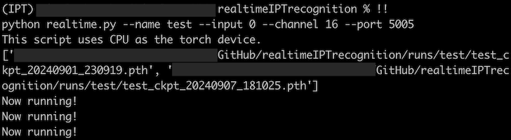
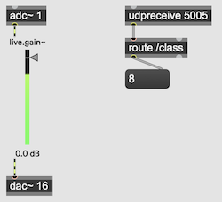

# Real-Time Instrumental Playing Techniques Recognition


This project focuses on real-time recognition of instrumental playing techniques using advanced machine learning models. It enables the automatic identification of various playing techniques in real time from a solo instrument's audio stream input. This repository includes tools for preparing datasets, training models, evaluating their performance, and real-time inference.

**Lead Developer:** [Nicolas Brochec](https://orcid.org/0009-0000-5922-2079), Tokyo University of the Arts, ERC Reach.

**Contributor:** [Marco Fiorini](https://orcid.org/0009-0004-0523-2481), IRCAM-STMS, CNRS, Sorbonne Université, ERC Reach.

## Installation
Clone this repository and navigate to the folder.
```
git clone https://github.com/nbrochec/realtimeIPTrecognition/
cd realtimeIPTrecognition
```
Create a conda environment with Python 3.11.7
```
conda create --name IPT python=3.11.7
```
```
source activate base
```
```
conda activate IPT
```
Make sure that `portaudio`is installed on your computer.
On Linux:
```
sudo apt-get install portaudio19-dev
```
On MacOS using Homebrew:
```
brew install portaudio
```
Install dependencies.
```
pip install -r requirements.txt
```
Install PyAudio separately.
```
pip install pyaudio
```

## Folder structure

```
└── 📁data
    └── 📁dataset
    └── 📁raw_data
        └── 📁test
        └── 📁train
└── 📁externals
    └── 📁pytorch_balanced_sampler
        └── __init__.py
        └── sampler.py
        └── utils.py
└── 📁models
    └── __init__.py
    └── layers.py
    └── models.py
    └── utils.py
└── 📁utils
    └── __init__.py
    └── augmentation.py
    └── constants.py
    └── rt.py
    └── utils.py
└── check_io.py
└── LICENCE
└── preprocess.py
└── README.md
└── requirements.txt
└── realtime.py
└── train.py
```

## Usage
### Dataset preparation

You can drag and drop the folder containing your training audio files into the `/data/dataset/raw_sample/train/` folder and your test audio files into the `/data/dataset/raw_sample/test/` folder.

For IPT classes, test and train folders must share the same name. The class label is retrieved from the name of your IPT class folders.
```
└── 📁test
    └── 📁myTestDataset
        └── 📁IPTclass_1
            └── audiofile1.wav
            └── audiofile2.wav
            └── ...
        └── 📁IPTclass_2
            └── audiofile1.wav
            └── audiofile2.wav
            └── ...
        └── ...
└── 📁train
    └── 📁myTrainingDataset
        └── 📁IPTclass_1
            └── audiofile1.wav
            └── audiofile2.wav
            └── ...
        └── 📁IPTclass_2
            └── audiofile1.wav
            └── audiofile2.wav
            └── ...
        └── ...
```

You can use multiple training datasets. They must share the same names for IPT classes as well.

```
└── 📁train
    └── 📁myTrainingDataset1
        └── 📁IPTclass_1
        └── 📁IPTclass_2
        └── ...
    └── 📁myTrainingDataset2
        └── 📁IPTclass_1
        └── 📁IPTclass_2
        └── ...
    └── ...
```

### Preprocess your datasets

Use `screen` to access multiple separate login session insde a single terminal window.
Open a screen.
```
screen -S IPT
conda activate IPT
cd realtimeIPTrecognition
```

To preprocess your datasets, use the following command. The only required argument is `--name`.
```
python preprocess.py --name project_name
```

| Argument            | Description                                                         | Possible Values                | Default Value   |
|---------------------|---------------------------------------------------------------------|--------------------------------|-----------------|
| `--name`            | Name of the project.                                               | String                         | `None`          |
| `--train_dir`       | Specify train directory.                                           | String                         | `train`          |
| `--test_dir`        | Specify test directory.                                             | String                         | `test`          |
| `--val_dir`         | Specify val directory.                                             | String                         | `val`          |
| `--val_split`       | Specify from which dataset the validation set will be generated.      | `train`, `test`                   | `train`      |
| `--val_ratio`       | Amount of validation samples.                                     | 0 <= Float value < 1             | `0.2`           |

If `--val_dir`is not specified, the validation set will be generated from the folder specified with `--val_split`.

A CSV file will be saved in the `/data/dataset/` folder with the following syntax:
```
project_name_dataset_split.csv
```

### Training
There are many different configurations for training your model. The only required argument is `--name`.
To train your model use the following command.
```
python train.py --name project_name
```
You can use the following arguments if you want to test different configurations.
| Argument            | Description                                                         | Possible Values                | Default Value   |
|---------------------|---------------------------------------------------------------------|--------------------------------|-----------------|  
| `--name`             | Name of the project.                                              | String                         |           |
| `--device`          | Specify the hardware on which computation should be performed.     | `cpu`, `cuda`, `mps`           | `cpu`           |
| `--gpu`             | Specify which GPU to use.                                          | Integer                          | `0`             |
| `--config`          | Name of the model's architecture.                                  | `v1`, `v2`, `v3`  | `v2`   |
| `--sr`              | Sampling rate for downsampling the audio files.                    | Integer (Hz)                   | `24000`         |
| `--segment_overlap` | Overlap between audio segments. Increase the data samples by a factor 2. | `True`, `False`                | `False`         |
| `--fmin`            | Minimum frequency for Mel filters.                                 | Integer (Hz)                    | `0`          |
| `--lr`              | Learning rate.                                                      | Float value > 0              | `0.001`         |
| `--batch_size`       | Specify Batch Size                                               | Integer value > 0            | `128`         |
| `--epochs`          | Number of training epochs.                                         | Integer value > 0            | `100`           |
| `--offline_augment` | Use offline augmentations generated from original audio files using detuning, gaussian noise and time stretching. Stored in a Pytorch Dataset. | `True`, `False` | `True` |
| `--online_augment`  | Specify which online augmentations to use. Applied in the training loop. Each augmentation has 50% chance to be applied. | `pitchshift`, `timeshift`, `polarityinversion`, `hpf`, `lpf`, `clipping`,`bitcrush`, `airabso`, `aliasing`, `mp3comp`, `trim` | `None` |
| `--padding`         | Pad the arrays of audio samples with zeros. `minimal` only pads when audio file length is shorter than the model input length. | `full`, `minimal`, `None`  | `minimal`           |
| `--early_stopping`  | Number of epochs without improvement before early stopping.         | Integer value > 0, or `None`   | `None`          |
| `--reduce_lr`        | Reduce learning rate if validation plateaus.                       | `True`, `False`                | `False`         |
| `--export_ts`       | Export the model as a TorchScript file (`.ts` format).              | `True`, `False`               | `True`         |
| `--save_logs`       | Save logs results to disk.                                          | `True`, `False`               | `True`         |

Training your model will create a `runs` folder with the name of your project.
Detach from current screen `ctrl`+`A`+`D`.
Open a new screen.
```
screen -S monitor
conda activate IPT
cd realtimeIPTrecognition
```

You can monitor the training using tensorboard.
Confusion matrix and results will be uploaded to tensorboard after training.
```
tensorboard --logdir . --bind_all
```

If you are working on a remote ssh server, use the following command to connect on the server, and monitor with tensorboard from your internet browser.
```
ssh -L 6006:localhost:6006 user@server
```

A project folder with the date and time attached will be created such as `project_name_date_time`.
After training, the script automatically saves the model checkpoints in the `/runs/project_name_date_time/` folder.
If you use `--export_ts True`, the `.ts` file will be saved in the same folder.

```
└── 📁runs
    └── 📁project_name_date_time
```

The results and the confusion matrix will be saved to disk as a CSV file in the `logs` directory.
```
└── 📁logs
    └── 📁project_name_date_time
        └── cm_project_name_date_time.csv
        └── results_project_name_date_time.csv
```

### Running the model in real-time

To run your model in real time, you need first to check available audio input devices of your computer with the script `check_io.py`.

```
python check_io.py
```

This will display a list of the devices and their respective ID.
The use of BlackHole to route the audio stream from Max to PyAudio is recommended.
```
Input Device ID  0  -  MacBook Pro Microphone
Input Device ID  1  -  BlackHole 2ch
Input Device ID  2  -  BlackHole 16ch
```

Once you have found your device ID, use the command `python realtime.py` to run your model in real time. The arguments `--name`, `--input`, and `--channel` are required.
The script will automatically run the most recent model saved in the `runs` folder.
```
python realtime.py --name your_project --input 0 --channel 1 
```

| Argument            | Description                                                         | Possible Values                | Default Value   |
|---------------------|---------------------------------------------------------------------|--------------------------------|-----------------|
| `--name`            | Name of the project.                                                | String                         | `None`          |
| `--input`           | Specify the audio device ID.                                        | String                         | `None`          |
| `--channel`         | Specify the channel of the audio device.                            | String                         | `None`          |
| `--device`          | Specify the hardware on which computation should be performed.      | `cpu`, `cuda`, `mps`           | `cpu`           |
| `--gpu`             | Specify which GPU to use.                                           | Integer                        | `0`             |
| `--buffer_size`     | Specify audio buffer size.                                          | Integer                        | `256`           |
| `--moving_average`  | Window size for smoothing predictions with a moving average.        | Integer                        | `5`             |
| `--port`            | Specify UDP port.                                                   | Integer                        | `5005`          |

Predictions [0, n_class-1] are sent via UDP through selected port (default is 5005) with a `/class` address.
Use a UDP receiver to retrieve the predictions as integers.

## Real-time Usage Example




## Related works
If you use this code in your research, please cite the following papers.

```
@inproceedings{brochec:hal-04642673,
  TITLE = {{Microphone-based Data Augmentation for Automatic Recognition of Instrumental Playing Techniques}},
  AUTHOR = {Brochec, Nicolas and Tanaka, Tsubasa and Howie, Will},
  URL = {https://hal.science/hal-04642673},
  BOOKTITLE = {{International Computer Music Conference (ICMC 2024)}},
  ADDRESS = {Seoul, South Korea},
  YEAR = {2024},
  MONTH = Jul,
  PDF = {https://hal.science/hal-04642673/file/Brochec_Microphone_based_Data_Augmentation_for_Automatic_Recognition_of_Instrument_Playing_Techniques_.pdf},
  HAL_ID = {hal-04642673},
  HAL_VERSION = {v1},
}

@inproceedings{fiorini:hal-04635907,
  TITLE = {{Guiding Co-Creative Musical Agents through Real-Time Flute Instrumental Playing Technique Recognition}},
  AUTHOR = {Fiorini, Marco and Brochec, Nicolas},
  URL = {https://hal.science/hal-04635907},
  BOOKTITLE = {{Sound and Music Computing Conference (SMC 2024)}},
  ADDRESS = {Porto, Portugal},
  YEAR = {2024},
  MONTH = Jul,
  KEYWORDS = {AI ; Co-creativity ; Instrumental playing techniques ; Multi-agent system ; Somax2},
  PDF = {https://hal.science/hal-04635907/file/SMC2024_GUIDING_CO_CREATIVE_MUSICAL_AGENTS_THROUGH_REAL_TIME_FLUTE_INSTRUMENTAL_PLAYING_TECHNIQUE_RECOGNITION_CAMERA_READY.pdf},
  HAL_ID = {hal-04635907},
  HAL_VERSION = {v1},
}
```
### Other related paper
• Nicolas Brochec and Tsubasa Tanaka. [Toward Real-Time Recognition of Instrumental Playing Techniques for Mixed Music: A Preliminary Analysis](https://hal.science/hal-04263718). International Computer Music Conference (ICMC 2023), Oct 2023, Shenzhen, China.

### Datasets
• Nicolas Brochec and Will Howie. [GFDatabase: A Database of Flute Playing Techniques](https://zenodo.org/records/13898549) (version 1.1). Zenodo, 2024.

## Acknowledgments
This project uses code from the [pytorch_balanced_sampler](https://github.com/khornlund/pytorch-balanced-sampler) repository created by Karl Hornlund.

## Funding
This work is supported by the [ERC Reach](https://reach.ircam.fr/) (Raising Co-creativity in Cyber-Human Musicianship), hosted at [IRCAM](https://www.ircam.fr/recherche/equipes-recherche/repmus/), directed by Gérard Assayag.
